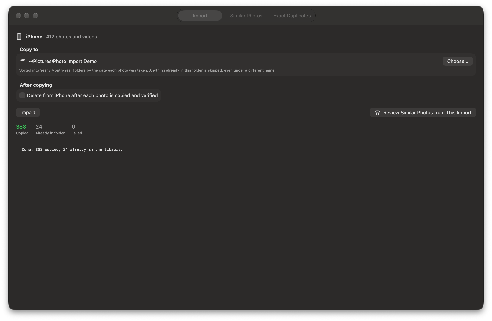
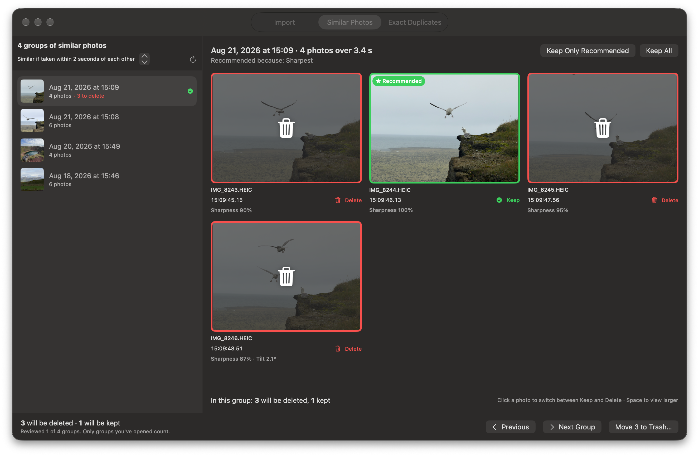
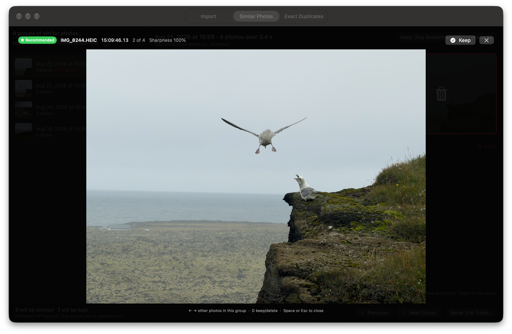
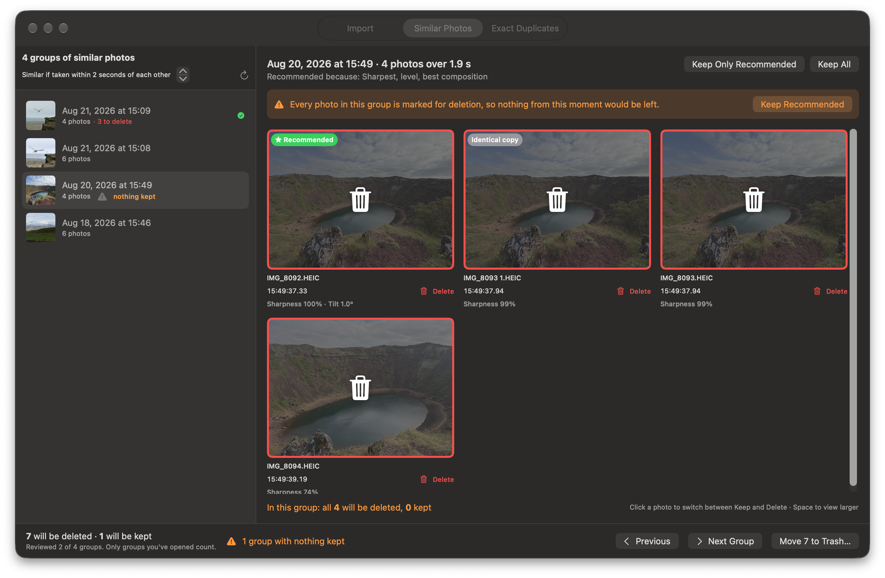
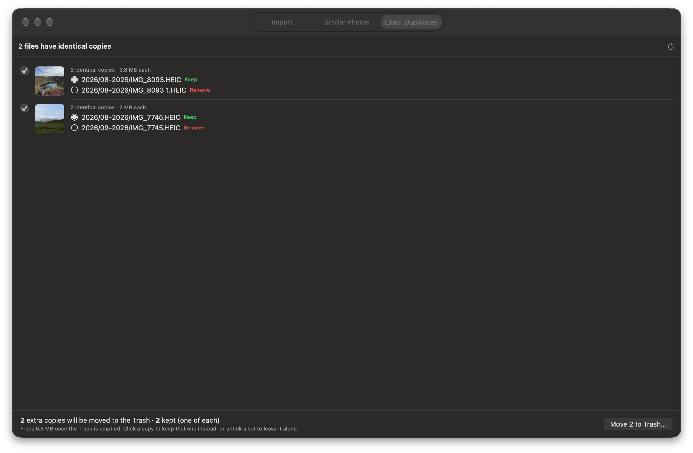

# Photo Import


A small Mac app for getting photos off an iPhone over a cable, and for cleaning up what you've got afterwards.

* **Import** copies everything into `Year/MM-Year` folders by the date each photo was taken, skips anything you already have, and can delete from the iPhone, but only after each copy is verified.
* **Similar Photos** groups bursts of near-identical shots, recommends the best one, and lets you keep or delete the rest.
* **Exact Duplicates** finds byte-for-byte identical files anywhere in the folder and removes the extra copies.

Everything runs on your Mac. No photos are uploaded anywhere.

## Import



* Copies photos, videos, Live Photo videos, and edit files (`.AAE`) into `2026/09-2026/…`-style folders, using the capture date from each file's metadata.
* Skips anything whose exact contents are already in the folder, even under a different name. The folder is fingerprinted (SHA-256) once, and later imports reuse that cache.
* Name clashes get a Finder-style suffix (`IMG_1 1.HEIC`), and a Live Photo's video gets the same suffix so the pair stays together.
* **Delete from iPhone after import** is off by default and needs confirming on every run. An item is deleted from the phone only after every part of it is in the folder *and* a second, independent read from the phone matches the copy byte for byte.
* When an import finishes, **Review Similar Photos from This Import** jumps to the groups that include the photos you just copied.

## Similar Photos



* Photos taken within 2 seconds of the previous one form a group, with a clear gap before and after. The gap is adjustable.
* Each group gets a **recommended** shot. The pick weighs sharpness, eyes open, Apple's face-quality score, a level horizon, and Apple's aesthetics score, each compared with the rest of the group. All of it comes from Apple's on-device Vision framework plus simple image math.
* Opening a group keeps the recommendation and marks the rest for deletion. Click any photo to switch it between Keep and Delete. Groups you haven't opened are never touched.
* A running total shows how many photos will be deleted and how many kept.
* Deleting moves photos to the **Trash**, along with the Live Photo videos and edit files that belong to them.

Press **Space** over a photo to see it large. **← →** step through the group and **D** switches Keep/Delete.



If every photo in a group is marked, you get a warning before anything happens:



## Exact Duplicates



* Finds files with identical contents anywhere in the folder: photos, videos, anything.
* Keeps one copy of each (by default the one without a ` 1` suffix). Click another copy to keep that one instead, or untick a set to leave it alone.
* Nothing is removed until you confirm. Right before a file is moved to the Trash, both it and the copy being kept are re-checked. Anything that changed since the scan is left alone.

## Build and run

Requires macOS 15 or later and Xcode 16 or later.

```bash
./scripts/make-app.sh && open "build/Photo Import.app"
```

```bash
swift test
```

### Command line

Neither mode deletes anything.

* `PhotoImport --import-to <folder>` copies everything from the connected iPhone.
* `PhotoImport --similar <folder> --limit 5` prints the groups and the recommended pick for the newest 5.

### Regenerating the screenshots and icon

* Screenshots: `open -n "build/Photo Import.app" --args --screenshots docs/screenshots -libraryPath <demo folder>`. This drives the real UI against a demo folder. The Import tab shows a staged "finished" state. For true window captures, give Photo Import Screen Recording permission. Without it, the app renders its own views, which can't draw translucent controls.
* Icon: `swift scripts/make-icon.swift Resources/AppIcon-1024.png`.

## How it's built

* `Sources/PhotoImportCore`: everything that doesn't need an iPhone. That includes the library layout, the content-hash index, import and delete gating, grouping, scoring, recommendations, and duplicate removal. It's covered by the unit tests.
* `Sources/PhotoImport`: the SwiftUI app and the ImageCaptureCore code that talks to the phone.
